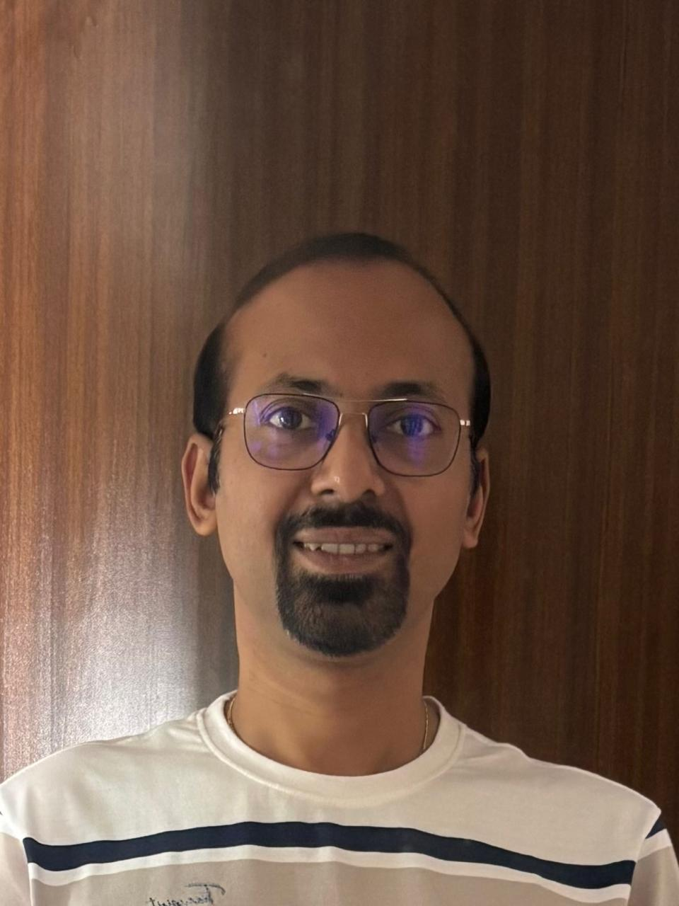

<table style="width:100%; border-collapse:collapse;">
<tr>
<td style="width:100px; vertical-align:middle; padding-right:20px; text-align:left;">

</td>
<td style="vertical-align:middle; text-align:left;">
<h1 style="margin:0; font-size:28px; line-height:1.2;">Sourav Das Biswas</h1>

<strong>Senior FastTrack Solution Architect</strong>

</td>
<td style="vertical-align:middle; text-align:right; padding-left:20px; white-space:nowrap;">

📧 <a href="mailto:sobiswas@microsoft.com">sobiswas@microsoft.com</a> 
📞 +91-9830436633 
🔗 <a href="https://linkedin.com/in/souravdasbiswas">linkedin.com/in/souravdasbiswas</a>

</td>
</tr>
</table>

---

## **SUMMARY**

Strategic and customer-obsessed Product Leader with deep expertise in Dynamics 365, Azure, and AI-driven product innovation. Proven success in driving feature adoption, improving user engagement, and shaping product direction through cross-functional collaboration and data-driven decision-making. Adept at translating complex technical capabilities into business outcomes that scale across enterprise environments.

---

## **CORE COMPETENCIES**

* Product Strategy & Roadmapping
* AI-driven Experimentation (Vibe Coding, Eval Frameworks)
* User Growth & Feature Adoption
* Cross-functional Leadership
* Data-informed Decision Making
* Go-to-Market Enablement

---

## **INNOVATION & THOUGHT LEADERSHIP**

* **Guest Speaker (ValueMomentum):** Delivered a hands-on session at ValueMomentum as a Microsoft guest speaker, showcasing rapid innovation through vibe coding, model evaluation and fine-tuning. 
    * LinkedIn Post - [LinkedIn Post to Vibe Coding Session](https://www.linkedin.com/feed/update/urn:li:activity:7382843235569823744/)
    * Github Repo - [GitHub Repo for VibeShieldInsurance Portal - A Vibe Coded Portal](https://github.com/souravdasbiswas/VibeShieldInsurance) 
.
* **Microsoft Garage Award:** Developed a driver fatigue detection system using machine learning.
* **Microsoft Hackathon Innovation:** Built gesture-to-voice communication tech for children with cerebral palsy.

---

## **EXPERIENCE**

### **Microsoft – Senior FastTrack Solution Architect / Program Manager**

*November 2021 – Present | 4 years*

* Defined and executed adoption strategy for Copilot features, driving a 12% uplift in active usage by aligning product capabilities with user workflows for one of the large Dynamics CRM customer in India.
* Partnered with engineering to influence product roadmap and close key feature gaps identified through customer telemetry and qualitative insights. This resulted in increase in Dynamics CRM Sales MAU from 8K to 78K.
* Championed data-driven evaluation to assess AI feature quality and optimize user engagement.
* Collaborated with Dataverse search engineering teams to enhance scalability, index synchronization, resulting in improved feature adoption and 128K MAU impact.
* Delivered multiple community sessions on AI-driven agentic workflows and Copilot capabilities, including a hands-on workshop on AI-driven product prototyping using Vibe Coding, Eval frameworks, and model fine-tuning as a Microsoft guest speaker at ValueMomentum

### **Microsoft – Solution Architect**

*June 2017 – November 2021 | 4 years 6 months*

* Led multiple Dynamics 365 implementations across industries, managing end-to-end solution design, deployment, and performance optimization.
* Partnered with global enterprise clients to define product adoption strategies and support business process transformation.
* Supported pre-sales efforts and contributed to RFPs and solution design for strategic enterprise accounts.

### **IBM – Solution Architect**

*July 2016 – May 2017 | 11 months*

* Oversaw CRM implementations in manufacturing and fintech domains, ensuring alignment of product architecture with customer outcomes.

### **Cognizant – Sr. Project Manager**

*October 2010 – July 2016 | 5 years 9 months*

* Directed Dynamics CRM implementations across Banking, Manufacturing, and Retail sectors.
* Managed distributed teams and delivered enterprise-scale deployments with measurable business impact.

### **Deloitte – Sr. Analyst**

*May 2009 – October 2010 | 1 year 8 months*

* Delivered scalable web-based applications using Microsoft .NET technologies.
* Supported clients across diverse industries through design, development, and rollout of digital solutions.

### **Wipro – Project Engineer**

*September 2004 – May 2009 | 4 years 7 months*

* Progressed from developer to lead developer, contributing to .NET-based enterprise application development.

---

## **EDUCATION**

* **Birla Institute of Technology and Science, Pilani** – MS, Software Engineering
* **University of Calcutta** – B.Sc. in Computer Science (First Class First in University)

---

## **CERTIFICATIONS & CONTINUOUS LEARNING**

### **🤖 AI & Machine Learning**
* **Deep Learning Specialization (Authored by Andrew Ng at Coursera)- AZYTPJEKC9H8**
    * Neural Networks and Deep Learning - EKWV9PFZSASS
    * Improving Deep Neural Networks: Hyperparameter tuning
    * Regularization and Optimization - ECT5RYU6G4LH
    * Structuring Machine Learning Projects - RLNL2S5SWVEP
    * Convolutional Neural Networks - EYEQ7MKA3MMU
    * Sequence Models - CA5AP3SFLZ8B
* **Agentic AI from deeplearning.ai**
* **ChatGPT Prompt Engineering for Developers from deeplearning.ai**

### **☁️ Cloud & Platform**
* **Microsoft Certified: Azure Fundamentals**
* **Microsoft Dynamics 365 CE Online Deployment**

### **💼 Professional Development**
* **Technical Leadership Development Program**
* **Microsoft Certified Professionals (MCP)**
* **Microsoft Certified Application Developer – ASP.NET**

---

## **ADDITIONAL EXPERIENCE**

* **Startup Experience:** Founded a medicine delivery app, gaining first-hand exposure to product-market fit challenges and go-to-market planning.

---

## **HOBBIES**

Photography | Painting 